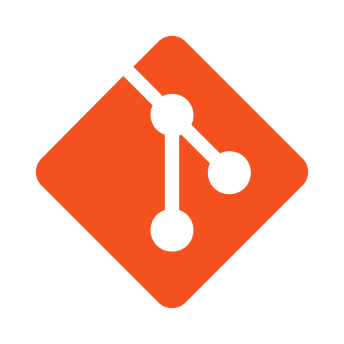
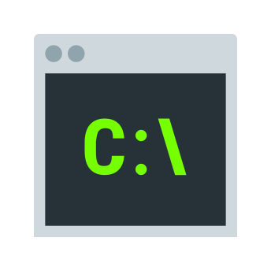
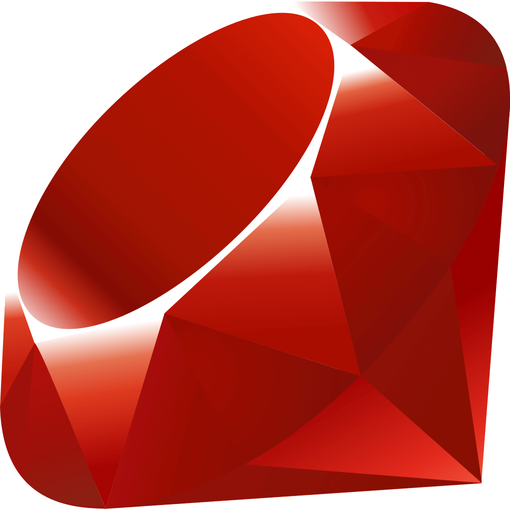
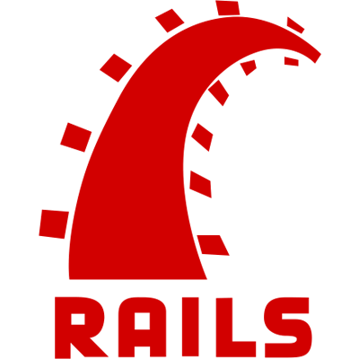

### Hola 👋, Im Hector

Hey its me Hector and im going to write something here

- 🔭 I’m currently working on personal projects
- 🌱 I’m currently learning Ruby
- 👯 I’m looking to collaborate on anything javascript!
- 🤔 I’m looking for help with finding a web dev role
- 💬 Ask me about myself or my code
- 📫 How to reach me: hectorpwns@gmail.com
- 😄 Pronouns: He/Him
- ⚡ Fun fact: I'm trained as a Nurse and still work as one

### Languages I love

     

### Enjoyable Frameworks:

   

### Tools

      

### Environments and Deploying projects

### Currently learning

 

